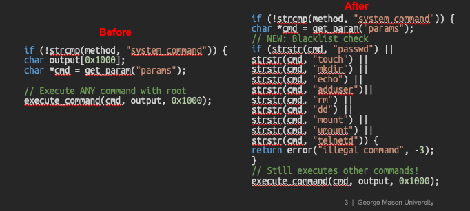

# CVE-2025-65294

Aqara Hub and Camera Hub devices contain an undocumented remote access mechanism ("backdoor") enabling unrestricted remote command execution.

**Keywords:** Remote Code Execution, Unauthorized Access

## Description
The firmware contains a mechanism allowing Aqara to execute arbitrary shell commands with root privileges on deployed devices via CoAP path `/lumi/gw/rpc` with method such as `system_run`. We found this capability is not documented in product specifications or Privacy Notice, generates no audit trail or activity logs, allows access to other network devices, operates without user notification or consent.

## Technical Details

### Command Handler Function
The main command handler is located at `sub_767E70` in the `ha_master` binary, example of Aqara Hub M2 - Firmware 4.3.6_0027. This function processes commands received via CoAP RPC and implements 17 distinct command types, including two that enable arbitrary command execution.

### Command Execution Methods

**Critical Security Commands:**

1. **system_command** (ha_master:768424-7684f8)
   - Executes arbitrary system commands **synchronously (blocking)**
   - **Captures and returns command output** in JSON result field
   - Implementation:
     ```c
     char output_buffer[0x1000];  // 4096 bytes
     char *command = get_param("params");
     execute_command(command, output_buffer, 0x1000);
     json_result["result"] = output_buffer ? output_buffer : "null";
     return json_result;
     ```
   - Full stdout/stderr capture sent back to server
   - No access controls or command filtering
   - Execution blocks until command completes

2. **system_run** (ha_master:76851c-76853c)
   - Executes commands **asynchronously (non-blocking)**
   - Runs in background with root privileges
   - **No output capture** - fire-and-forget execution
   - Implementation: `system(command + " &")`
   - Silent background execution without user notification
   - Returns immediately without waiting for completion

**Additional Privileged Commands:**

3. **reboot** (ha_master:767ff0) - Reboots device with 5-second delay
4. **wifi_config** (ha_master:76822c) - Modifies WiFi credentials (requires: ssid, passphrase)
5. **hap_config** (ha_master:768178) - Configures HomeKit tokens (requires: token_uuid, token_key)
6. **debug_log** (ha_master:7682a0) - Controls debug logging output
7. **log_redirect** (ha_master:7682f8) - Redirects system logs
8. **property_get** (ha_master:768360) - Reads device configuration properties
9. **lan_debug** (ha_master:76854c) - LAN debugging control
10. **matter_debug** (ha_master:7685d0) - Matter protocol debugging
11. **debug_control** (ha_master:768648) - Debug control with log_events support
12. **debug_mode** (ha_master:768138) - Enables/disables debug mode
13. **android_debug** (ha_master:76863c) - Android subsystem debugging
14. **zigbee_command** (ha_master:76871c) - Sends Zigbee protocol commands
15. **zigbee_channel** (ha_master:76877c) - Changes Zigbee channel (version: "8.0.2024")
16. **acc_debug** (ha_master:768770) - Accessory debug mode
17. **hub_backup** (ha_master:7687c8) - Creates hub backup (calls hub_backup_info)

All commands are processed without authentication beyond CoAP encryption and generate no audit trail.

## Replication Steps

### Method 1: Using system_command (with output)
1. Establish CoAP connection to device
2. Send request to `/lumi/gw/rpc` with JSON payload:
   ```json
   {
     "method": "system_command",
     "params": "ls -la /tmp"
   }
   ```
3. Observe command execution with output returned in response

### Method 2: Using system_run (background execution)
1. Establish CoAP connection to device
2. Send request to `/lumi/gw/rpc` with JSON payload:
   ```json
   {
     "method": "system_run",
     "params": "/bin/touch /tmp/hacked"
   }
   ```
3. Command executes in background with root privileges, no output returned

## Test Products
- **Aqara Camera Hub G3** - Firmware 4.1.9_0027
  - ha_master: f685eb25a115af88a181844a308733f555ad6a787c8bee593f27e583828faf26
- **Aqara Hub M2** - Firmware 4.3.6_0027
  - ha_master: f7d23419ea73bbe29ada6423ac98f9edfa96c6acf72c5b7f3571389214f52072
- **Aqara Hub M3** - Firmware 4.3.6_0025
  - ha_master: 224583b493b27b7070c9f7a7d77d1418a3807af6ea63c497f7ae8bdc45ec3510

## Analysis
**CVSS:3.1 9.8 Critical**

Vector: AV:N/AC:L/PR:N/UI:N/S:U/C:H/I:H/A:H


# Regression Testing Result

Aqara never responded to my inquiry about the precise software release version. Therefore, I conducted a regression test using the file `20250828112804_lumi.gateway.iragl5_AIOT_V4.3.8_0021.0652_20250826_f93a71.bin`, which has a sha256sum of `64672529e3545d887241a5d069f9757fe02a87e128af8d3cc1c7f78fd32c8fab`. This file is the latest available for M2 Hub that I could find, and its date matches the expectation provided by Aqara in an earlier email. 

The illustration below illustrates how they “patch” it, code reconstructed from assembly and truncated for ease of understand. Instead of eliminating this “backdoor,” they simply added a few easy-to-bypass filtering mechanisms. If you’re interested, you can check `ha_master@0x7A0384`.




## Timeline

- **July 3, 2025**: Reported to Aqara
- **October 10, 2025**: Vendor responded mitigation schedule. Hub M2: Firmware V4.3.8, OTA released August 28, 2025; Hub M3: Firmware V4.3.8, OTA released August 28, 2025; Camera Hub G3: Compatible firmware version, OTA released October 20, 2025.
- **October 27,2025**: the regression testing failed (as mentioned earlier). Inquired about the patching version clarification from Aqara, but I didn’t receive a response. 

## Credits
Junming Chen (George Mason University)
Xiaoyue Ma (George Mason University)
Lannan Lisa Luo, Ph.D. (George Mason University)
Qiang Zeng, Ph.D. (George Mason University)
